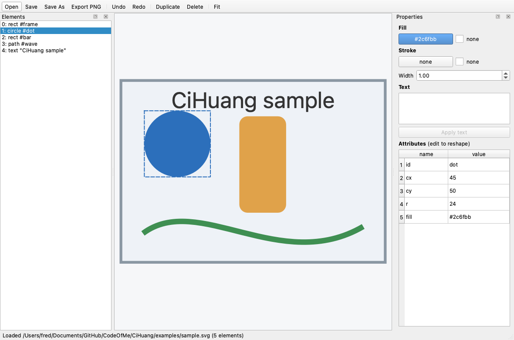

# CiHuang (雌黄) - SVG Element Editor

Click any single element of an SVG and move it, repaint it, reshape it, or rewrite its text.

> **CiHuang (雌黄)** is the yellow mineral scholars once used as correction fluid: you
> brush it over a wrong character and write the right one on top. This tool does the
> same to a drawing -- pick one piece, fix it, leave everything else untouched.

[中文说明](README_CN.md)

## Features

- **Open any SVG** -- a real SVG file is parsed as XML, not flattened to an image.
- **Click to select one element** -- hit-testing walks the elements in reverse paint
  order and tests actual pixels, so you select the shape you see, not its bounding box.
- **Drag to move** -- the move is written as a `translate(...)` on that element only.
- **Repaint** -- set `fill` and `stroke` with a color picker, or clear them to `none`.
- **Reshape** -- an editable table exposes every raw attribute (`cx`, `r`, `d`, `points`,
  `transform`, ...), so any geometry can be changed.
- **Edit text** -- rewrite the content of `<text>` elements.
- **Duplicate / delete / undo / redo**, save as SVG, export to PNG.
- **Scriptable** -- the same operations are available from the CLI, a Python API and an
  OpenAI function-calling tool set.

## Limitations

Worth knowing before you rely on it:

- Hit-testing renders each candidate to a raster capped at 1600 px, so a few clicks on
  a very large document can feel slow the first time; results are cached afterwards.
- Editing `<text>` replaces any `<tspan>` children with a single text run.
- The tool edits elements in place. It does not re-parent, re-order or group elements,
  and it does not touch `viewBox`, stylesheets inside `<style>`, or animations.
- `<image>` and `<use>` can be moved and recolored but their referenced content is not
  edited.
- It is an annotator, not a full vector editor: no bezier-point editing, no snapping.

## Requirements

- Python 3.10+
- `PySide6` (installed automatically)

## Installation

From PyPI:

```bash
pip install cihuang
```

From source:

```bash
git clone https://github.com/CodeOfMe/CiHuang.git
cd CiHuang
pip install -e .
```

## Quick Start

```bash
# Open the graphical editor
cihuang gui examples/sample.svg

# Or just list the editable elements of a file
cihuang info examples/sample.svg
```



## Usage

### GUI

```bash
cihuang gui drawing.svg
# or, equivalently:
cihuang-gui drawing.svg
```

Left mouse button selects and drags an element. Middle mouse button pans. The mouse
wheel zooms. The right dock edits fill, stroke, text and raw attributes; the left dock
lists every element.

### CLI

```bash
# List elements (add --json for machine output)
cihuang info drawing.svg

# Set the fill of element 3, writing drawing-edited.svg
cihuang fill drawing.svg 3 "#ff6600"

# Recolor the stroke instead, to an explicit output path
cihuang fill drawing.svg 3 "#003366" --stroke -o out.svg

# Clear an element's fill
cihuang fill drawing.svg 3

# Move element 1 by dx=20, dy=-5
cihuang move drawing.svg 1 20 -5

# Rewrite the text of element 5
cihuang text drawing.svg 5 "New label"

# Delete element 0
cihuang remove drawing.svg 0
```

## Python API

```python
from cihuang import SvgDocument, cihuang_set_color

# One-shot, writes drawing-edited.svg
result = cihuang_set_color(input_path="drawing.svg", element_index=3, color="#ff6600")
print(result.success)   # True / False
print(result.data)      # {"output": "...", "index": 3, "prop": "fill", "color": "#ff6600"}

# Or drive the document directly, then save wherever you like
doc = SvgDocument.load("drawing.svg")
doc.push_undo()
doc.set_color(3, "fill", "#ff6600")
doc.translate(3, 20, -5)
doc.set_text(5, "New label")
doc.save("out.svg")
```

## Agent Integration

The `TOOLS` list exposes the same operations for OpenAI function calling.

```python
from cihuang.tools import TOOLS, dispatch

payload = dispatch("cihuang_inspect", {"input_path": "drawing.svg"})
print(payload["success"])
```

## Development

```bash
pip install -e ".[dev]"
ruff format . && ruff check . && pytest
```

## License

GPL-3.0-or-later. See [LICENSE](LICENSE).
